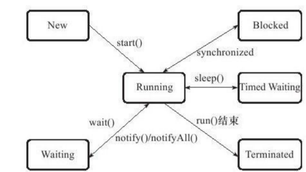

# 线程

1. 线程的实现
    - 线程是比进程更轻量级的调度执行单位，线程的引入，可以把一个进程的资源分配和执行调度分开，各个线程既可以共享进程资源（内存
    地址、文件I/O等），又可以独立调度（线程是CPU调度的基本单位）。
    - 主流的操作系统都提供了线程实现，Java语言则提供了在不同硬件和操作系统平台下对线程操作的统一处理，每个已经执行start()且还
    未结束的java.lang.Thread类的实例就代表了一个线程。

2. 实现线程的三种方式:
    1. 使用内核线程
       - 内核线程（Kernel-Level Thread,KLT）就是直接由操作系统内核（Kernel，下称内核）支持的线程，这种线程由内核来完成线程
         切换，内核通过操纵调度器（Scheduler）对线程进行调度，并负责将线程的任务映射到各个处理器上。

       - 程序一般不会直接去使用内核线程，而是去使用内核线程的一种高级接口——**轻量级进程**（Light Weight Process,LWP），轻量级进
         程就是我们通常意义上所讲的线程，由于每个轻量级进程都由一个内核线程支持，因此只有先支持内核线程，才能有轻量级进程。这种轻量
         级进程与内核线程之间1:1的关系称为一对一的线程模型

       - 好处:
            由于内核线程的支持，每个轻量级进程都成为一个独立的调度单元，即使有一个轻量级进程在系统调用中阻塞了，也不会影响整个
         进程继续工作.
       - 坏处:
            首先，由于是基于内核线程实现的，所以各种线程操作，如创建、析构及同步，都需要进行系统调用。而系统调用的代价相对较高，
         需要在用户态（User Mode）和内核态（KernelMode）中来回切换。其次，每个轻量级进程都需要有一个内核线程的支持，因此轻量级进
         程要消耗一定的内核资源（如内核线程的栈空间），因此一个系统支持轻量级进程的数量是有限的。

    2. 使用用户线程

         - 用户线程指的是完全建立在用户空间的线程库上，系统内核不能感知线程存在的实现。用户线程的建立、同步、销毁和调度完全在
         用户态中完成，不需要内核的帮助。如果程序实现得当，这种线程不需要切换到内核态，因此操作可以是非常快速且低消耗的，
         也可以支持规模更大的线程数量，部分高性能数据库中的多线程就是由用户线程实现的。这种进程与用户线程之间1：N的关系称为一对多
         的线程模型

         - 好处:
            不需要系统内核支援

         - 坏处:
            没有系统内核的支援，所有的线程操作都需要用户程序自己处理。线程的创建、切换和调度都是需要考虑的问题，而且
         由于操作系统只把处理器资源分配到进程，那诸如“阻塞如何处理”、“多处理器系统中如何将线程映射到其他处理器上”这类问题解决起
         来将会异常困难

    3. 使用用户线程加轻量级进程混合

         - 线程除了依赖内核线程实现和完全由用户程序自己实现之外，还有一种将内核线程与用
            户线程一起使用的实现方式。在这种混合实现下，既存在用户线程，也存在轻量级进程。用
            户线程还是完全建立在用户空间中，因此用户线程的创建、切换、析构等操作依然廉价，并
            且可以支持大规模的用户线程并发。而操作系统提供支持的轻量级进程则作为用户线程和内
            核线程之间的桥梁，
         - 这样可以使用内核提供的线程调度功能及处理器映射，并且用户线程的
            系统调用要通过轻量级线程来完成，大大降低了整个进程被完全阻塞的风险。在这种混合模
            式中，用户线程与轻量级进程的数量比是不定的，即为N：M的关系

    4. java的实现
       - 对于Sun JDK来说，它的Windows版与Linux版都是使用一对一的线程模型实现的，一条
        Java线程就映射到一条轻量级进程之中，因为Windows和Linux系统提供的线程模型就是一对
        一的。

       - 而在Solaris平台中，由于操作系统的线程特性可以同时支持一对一（通过Bound Threads
        或Alternate Libthread实现）及多对多（通过LWP/Thread Based Synchronization实现）的线程模
        型，因此在Solaris版的JDK中也对应提供了两个平台专有的虚拟机参数：-XX：
        +UseLWPSynchronization（默认值）和-XX：+UseBoundThreads来明确指定虚拟机使用哪种线
        程模型。
        
3. java线程的状态

    - new:新建，创建后尚未启动的线程处于这种状态。
    - running:运行，Runable包括了操作系统线程状态中的Running和Ready，也就是处于此状态的线程有可能正在执行，也有可能正在等待着
            CPU为它分配执行时间。
    - waiting:无期限等待，处于这种状态的线程不会被分配CPU执行时间，它们要等待其他线程显式地唤醒。
            以下方法会让线程陷入无限期的等待状态：
       - 没有设置Timeout参数的Object.wait()方法。
       - 没有设置Timeout参数的Thread.join()方法。
       - LockSupport.park()方法。
    - timed waiting:期限等待，：处于这种状态的线程也不会被分配CPU执行时间，不过无须等待被其他线程显式地唤醒，在一定时间之后它们会
            由系统自动唤醒。
            以下方法会让线程进入限期等待状态：
       - Thread.sleep（）方法。
       - 设置了Timeout参数的Object.wait（）方法。
       - 设置了Timeout参数的Thread.join（）方法。
       - LockSupport.parkNanos（）方法。
       - LockSupport.parkUntil（）方法。
    - blocked:阻塞，“阻塞状态”在等待着获取到一个排他锁，这个事件将***在另外一个线程放弃这个锁的时候发生***；
    - terminal:结束，已终止线程的线程状态，线程已经结束执行。
    

            